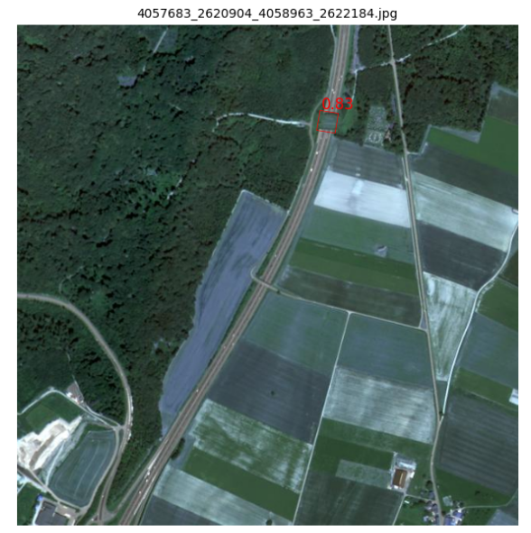

# CAS Spatial Data Analytics - Wildlife Crossing Detector

This repository was created by @rschre and @MaxHoeferGEOINFO during the CAS Spatial Data Analytics
at FHNW. It aims to train an object detector, which is able to recognize wildlife crossings on european roads.

### Folder Structure

```
//Folder for geodata and images, images are not stored in git repo
+---data  
//FME-Scripts, Overpass-Queries etc.
+---external_scripts 
+---model
|   +---checkpoints
|   +---runs
+---notebooks
//STDL Object Detector, needs to run on Linux
+---object-detector
|   +---data
|   +---scripts
//Start of creating a module, but it's not really finished/polished, some functions lay here
+---src
|   +---detect_wildlife_crossings
|   +---modelling
|   +---osm
|   +---wms
```

### Repo contains code to:
- Export wildlife crossings from OSM
- Download satellite images for these points from a WMS server
- Get the polygons from OSM and satellite images into YOLO format
- Train a YOLO-OBB v11 detection model
- Run inference and evaluate results of YOLO model

To get started take a look at the notebooks directory

### Results

The best weights overall are stored at the following place: [/model/runs/cassda-wildlife-crossing/yolo11n-obb-wildlife_bridges-filtered-dataset-no-CH-negatives-640/weights/best.pt)](model/runs/cassda-wildlife-crossing/yolo11n-obb-wildlife_bridges-filtered-dataset-no-CH-negatives-640/weights/best.pt)

#### Example Detection

